MINI CRM

SOBRE O PROJETO
O Mini CRM é uma aplicação de gestão para pequenas empresas, desenvolvida em Java (Spring Boot) no backend e React no frontend.
O sistema permite gerenciar clientes, pedidos, estoque, movimentações e relatórios, oferecendo uma visão integrada e simples do negócio.

---

ESTRUTURA DO PROJETO

---

TECNOLOGIAS UTILIZADAS
Backend:

- Java 17
- Spring Boot
- Spring Security
- Spring Data JPA
- PostgreSQL (via Docker)
- Maven

Frontend:

- React
- JavaScript/TypeScript
- Material UI
- PNPM

Infraestrutura:

- Docker (PostgreSQL container)
- Postman (coleção de testes)

---

TUTORIAL DE INSTALAÇÃO E EXECUÇÃO

1. Clonar o repositório:
   git clone https://github.com/Luisptbr/mini-crm.git
   cd mini-crm

2. Configurar o banco de dados (PostgreSQL via Docker):
   docker run --name mini-crm-db ^
   -e POSTGRES_PASSWORD=admin ^
   -e POSTGRES_USER=admin ^
   -e POSTGRES_DB=crmdb ^
   -p 5432:5432 -d postgres:15

3. Executar o backend:
   cd backend-crm
   mvn clean install
   mvn spring-boot:run
   Backend disponível em: http://localhost:8080

4. Executar o frontend:
   cd frontend-crm
   pnpm install
   pnpm start
   Frontend disponível em: http://localhost:3000

---

TESTES

- Os testes de API estão disponíveis em:
  backend-crm/TESTES.postman_collection.json

Para rodar:

1. Abra o Postman
2. Importe o arquivo .json
3. Execute a coleção para validar os endpoints

---

FUNCIONALIDADES

- Login com autenticação e roles (ADMIN / USER)
- Dashboard com visão geral
- Gestão de clientes
- Gestão de pedidos
- Controle de estoque
- Movimentações financeiras
- Relatórios integrados

---

## 📸 Capturas de Tela

### Login

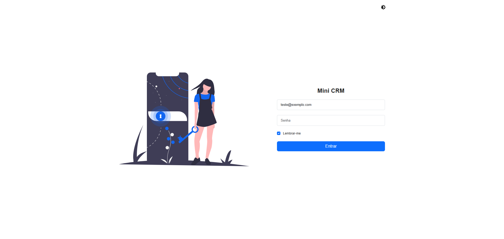
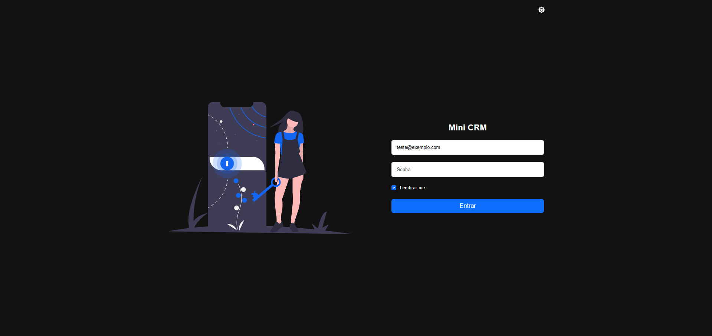

### Dashboard

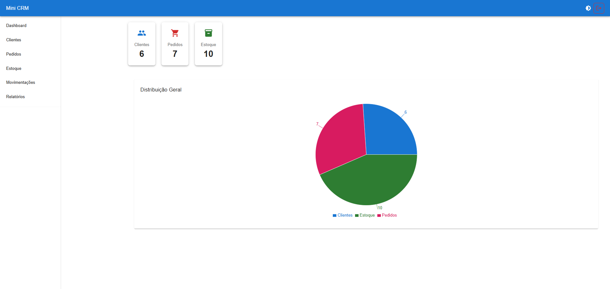
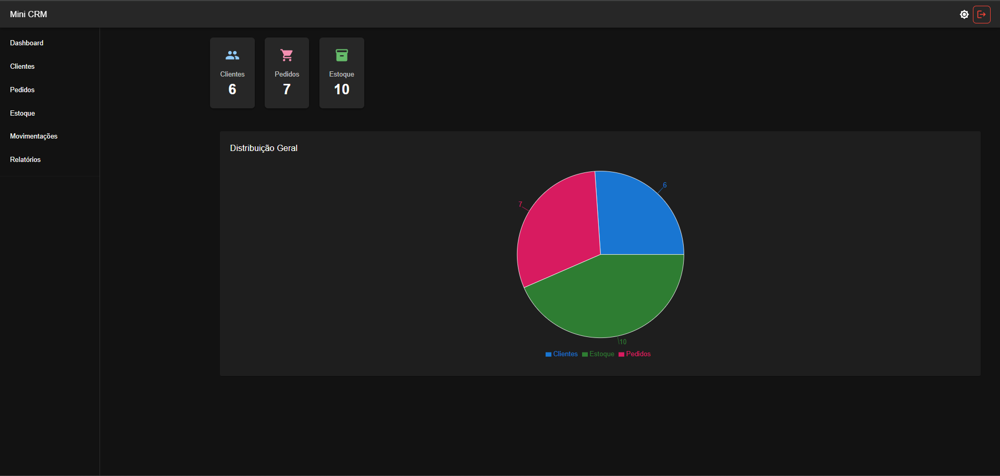

### Clientes

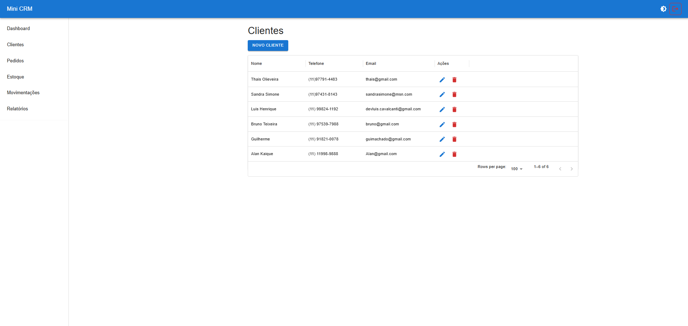
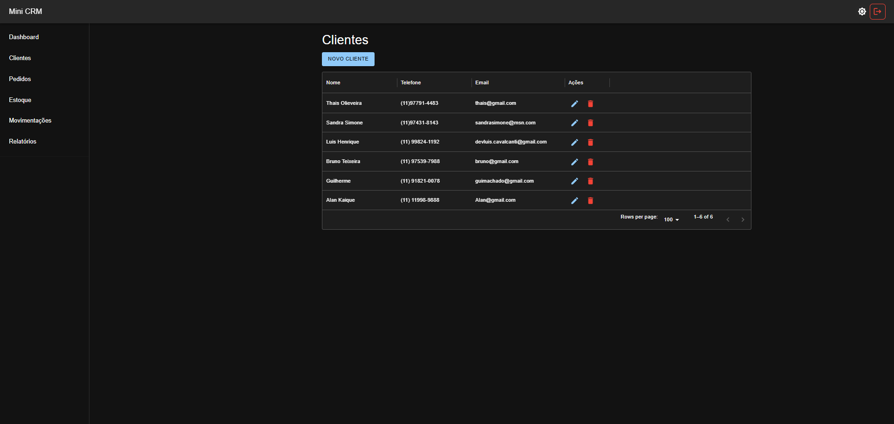

### Pedidos

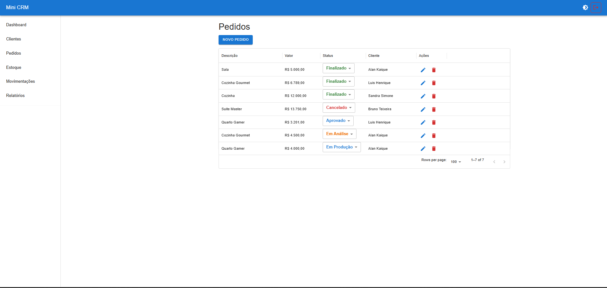
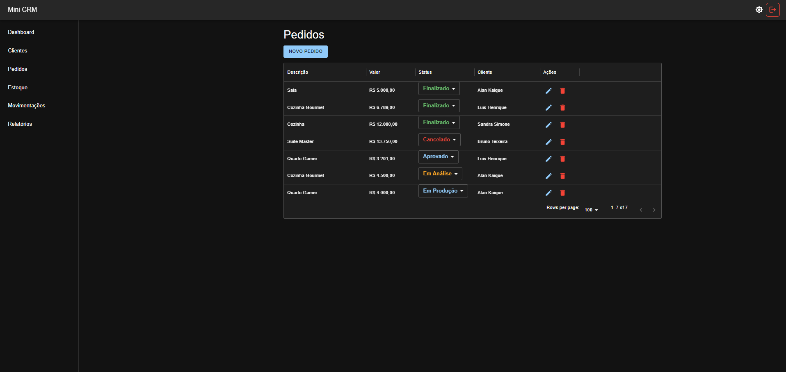

### Estoque

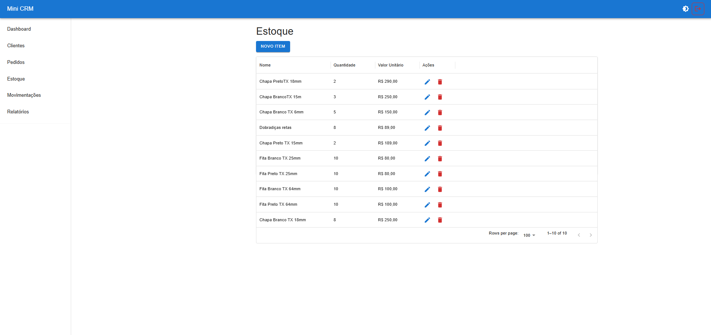
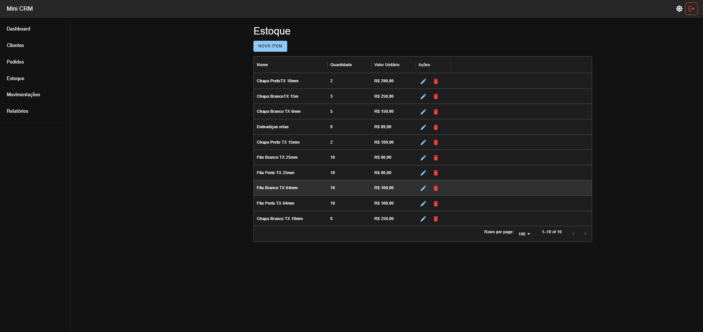

### Movimentações

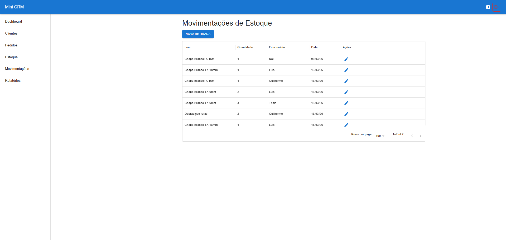
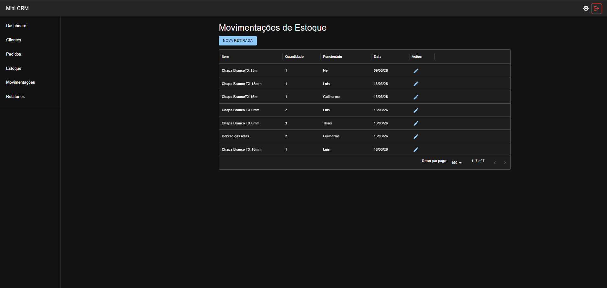

### Relatórios

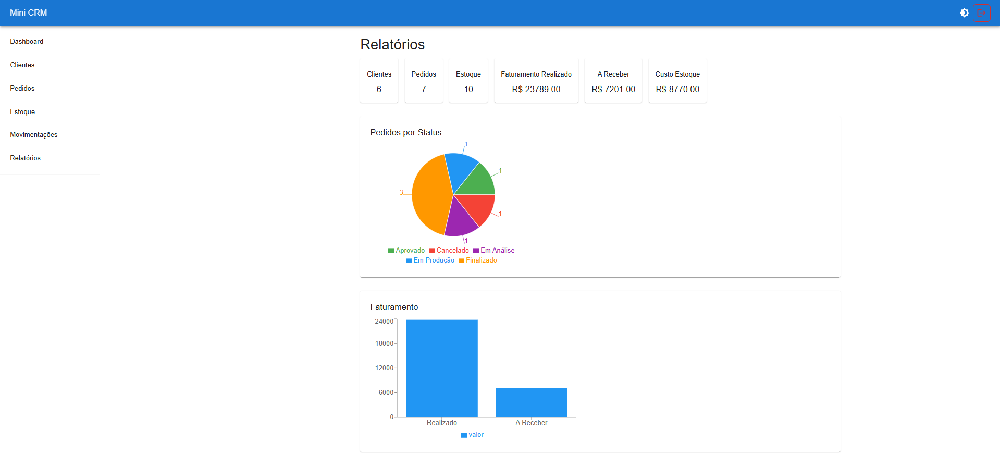
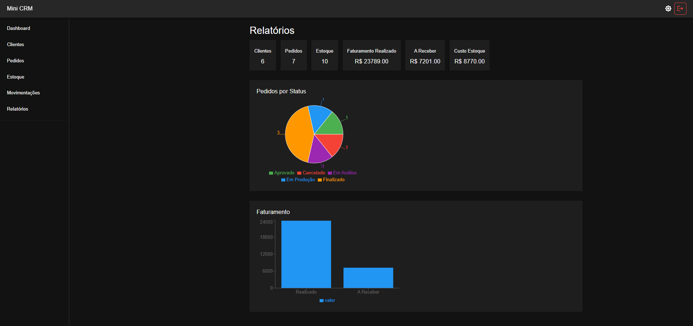

---

AUTOR
Projeto desenvolvido por Luis.
